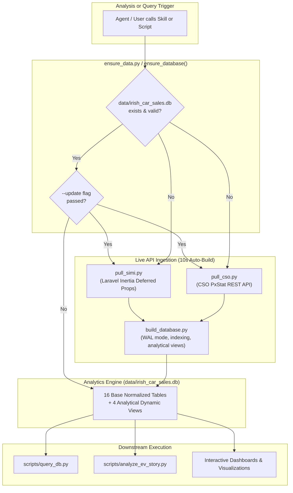

# Irish Car Sales & Vehicle Registrations Intelligence Skill

Use this skill to query, extract, normalize, and analyze official vehicle registration and car sales statistics for the Republic of Ireland.

The skill covers data from both official authorities:
1. **Central Statistics Office (CSO) Ireland**: Decades of historical monthly time-series cubes (1996–present) covering fuel types, models, county breakdowns, and new vs imported second-hand cars.
2. **Society of the Irish Motor Industry (SIMI)**: Real-time official industry portal (`stats.simi.ie`) providing current month registrations, brand/model rankings, transmissions (automatic vs manual), body styles, and commercial vehicles (LCV, HCV, Buses).

---

## 1. Zero-Friction Architecture: Self-Bootstrapping & Futureproof

> [!IMPORTANT]
> **Automatic Database Bootstrapping**
> The skill is 100% self-bootstrapping and invariant to time.
> - **If `data/irish_car_sales.db` does not exist**: Calling any analysis script or running `python3 scripts/ensure_data.py` automatically pulls official live data from SIMI and CSO Ireland, normalizes it, builds the indexed SQLite database, and cleans up temporary files in ~10 seconds.
> - **To update to the latest figures**: Pass `--update` to any pipeline or run `python3 scripts/ensure_data.py --update`.
> - **Futureproof schemas**: SIMI and CSO tables provide normalized, time-invariant columns (`year_latest`, `units_latest`, `market_share_pct_latest`, `change_pct_latest`, `year_prev`, `units_prev`) and dynamic views (`v_county_ev_ranking_latest`), ensuring queries never break across new reporting years.



---

## 2. Quickstart Reference

### 2.1 Ensuring the Database is Ready
Before running any analysis, simply call `ensure_data.py`:

```bash
# Verify or auto-build data/irish_car_sales.db if missing
python3 scripts/ensure_data.py

# Force refresh from live SIMI and CSO APIs
python3 scripts/ensure_data.py --update

# Verify database integrity only
python3 scripts/ensure_data.py --verify-only
```

### 2.2 Futureproof CLI Queries
All queries use time-invariant column names (`units_latest`, `market_share_pct_latest`) and dynamic views:

```bash
# 1. Annual powertrain market shares (all years dynamically)
python3 scripts/query_db.py "SELECT year, total_cars, electric, electric_share_pct, diesel, diesel_share_pct FROM v_powertrain_annual ORDER BY year DESC"

# 2. Latest county EV rankings (dynamically resolves the latest reporting year)
python3 scripts/query_db.py "SELECT licensing_authority, year, ev_units, total_units, ev_penetration_pct FROM v_county_ev_ranking_latest LIMIT 5"

# 3. Top 10 car brands YTD (using invariant units_latest)
python3 scripts/query_db.py "SELECT make, year_latest, units_latest, market_share_pct_latest FROM simi_passenger_makes ORDER BY units_latest DESC LIMIT 10"

# 4. Top 10 car models YTD (using rank_latest)
python3 scripts/query_db.py "SELECT rank_latest, make, model, units_latest, market_share_pct_latest FROM simi_passenger_models ORDER BY units_latest DESC LIMIT 10"

# 5. Export output to JSON
python3 scripts/query_db.py "SELECT transmission, units_latest, market_share_pct_latest FROM simi_passenger_transmissions" --format json
```

---

## 3. Database Schema & Tables Reference

The database `data/irish_car_sales.db` (SQLite 3, WAL mode) organizes 16 base tables and 4 analytical views:

### 3.1 Curated Analytical Views
| View Name | Primary Source | Timeframe | Description & Invariant Columns |
| :--- | :--- | :--- | :--- |
| `v_powertrain_annual` | CSO `TEM12` | 2015 – Present | Complete annual volumes & shares for BEV, Diesel, Petrol, Hybrids (HEV), and PHEVs across all historical years. |
| `v_ev_vs_diesel_crossover`| CSO `TEM12` | 2015 – Present | Monthly time series of Electric vs Diesel units and `ev_to_diesel_ratio`. Captures the monthly crossover point. |
| `v_county_ev_ranking_latest`| CSO `TEM27` | Dynamic Latest Year | Dynamically resolves the latest reporting year in the database. Returns `licensing_authority`, `year`, `ev_units`, `total_units`, `ev_penetration_pct`, `share_of_national_ev_pct`. |
| `v_model_historical_trajectory`| CSO `TEM20` | 2014 – Present | Multi-year model-level sales volumes for 330+ models (e.g., Volkswagen ID.4, Tesla Model 3/Y, Hyundai Tucson). |

### 3.2 Time-Invariant SIMI Base Tables
Every SIMI table includes both dynamic annual columns (`units_YYYY`) and standardized invariant columns:
* `year_latest`: Current reporting YTD year (e.g. `2026`).
* `units_latest`: Current YTD units.
* `market_share_pct_latest`: Current YTD market share %.
* `change_pct_latest`: Percentage change vs previous year YTD.
* `year_prev`: Previous year.
* `units_prev`: Previous year YTD units.

| Table Name | Category | Primary Key / Dimensions | Key Invariant Columns |
| :--- | :--- | :--- | :--- |
| `simi_passenger_makes` | Passenger | `make` | `make`, `year_latest`, `units_latest`, `market_share_pct_latest`, `change_pct_latest` |
| `simi_passenger_models` | Passenger | `make`, `model` | `make`, `model`, `rank_latest`, `units_latest`, `market_share_pct_latest`, `change_pct_latest` |
| `simi_passenger_fuels` | Passenger | `engine_type` | `engine_type`, `units_latest`, `market_share_pct_latest`, `change_pct_latest` |
| `simi_passenger_counties`| Passenger | `county` | `county`, `units_latest`, `market_share_pct_latest`, `change_pct_latest` |
| `simi_passenger_transmissions`| Passenger | `transmission` | `transmission` (Automatic ~81% vs Manual ~19%), `units_latest`, `market_share_pct_latest` |
| `simi_passenger_body_types`| Passenger | `body_type` | `body_type` (SUV ~60%, Hatchback, Saloon, Estate), `units_latest`, `market_share_pct_latest` |
| `simi_passenger_segments` | Passenger | `segment` | `segment` (B-Segment, Small SUV, Medium SUV), `units_latest` |
| `simi_passenger_colours` | Passenger | `colour` | `colour` (Grey ~38%, Black, White, Blue, Red), `units_latest`, `market_share_pct_latest` |
| `simi_passenger_monthly` | Passenger | `month`, `month_num` | `month`, `month_num`, `units_latest`, `change_pct_latest`, `units_prev` |
| `simi_passenger_ytd_totals` | Passenger | `year` | `year`, `ytd_units`, `change_pct`, `is_latest` |
| `simi_lcv_makes` / `totals`| Light Commercial | `make` | Van brand rankings and annual totals |
| `simi_hcv_makes` / `totals`| Heavy Commercial | `make` | Heavy truck brand rankings and annual totals |
| `simi_bus_makes` / `totals`| Buses & Coaches | `make` | Bus and coach brand rankings and annual totals |

### 3.3 CSO Base Tables
* `cso_taxation_class_monthly` (`TEM01`): 1996 – Present (~5,000+ rows). Columns: `month_code`, `date_val`, `year`, `month_num`, `taxation_class`, `units`. Tracks new vs secondhand UK imports.
* `cso_fuel_monthly` (`TEM12`): 2015 – Present (~16,800+ rows). Columns: `month_code`, `date_val`, `year`, `month_num`, `vehicle_class`, `fuel_type`, `units`.
* `cso_make_model_monthly` (`TEM20`): 2014 – Present (~100,000+ rows). Columns: `month_code`, `date_val`, `year`, `month_num`, `make`, `model`, `full_name`, `units`.
* `cso_county_fuel_monthly` (`TEM27`): 2021 – Present (~44,000+ rows). Columns: `month_code`, `date_val`, `year`, `month_num`, `reg_type`, `licensing_authority`, `fuel_type`, `units`.

---

## 4. Programmatic Workflows

### Workflow 0: Python Analysis with Automatic Database Ensuring
```python
import sqlite3
import pandas as pd
from ensure_data import ensure_database

# 1. Ensure database is present (auto-builds if missing)
db_path = ensure_database("data/irish_car_sales.db")
conn = sqlite3.connect(db_path)

# 2. Query dynamic latest county EV adoption
df_county = pd.read_sql_query("SELECT * FROM v_county_ev_ranking_latest", conn)

# 3. Query top EV models using invariant columns
df_top_models = pd.read_sql_query("""
    SELECT rank_latest, make, model, units_latest, market_share_pct_latest, change_pct_latest
    FROM simi_passenger_models
    ORDER BY units_latest DESC LIMIT 10
""", conn)

# 4. Extract latest reporting year dynamically
latest_year = df_county['year'].iloc[0]
print(f"Analysis successfully conducted for reporting year {latest_year}!")
conn.close()
```

### Workflow 1: Pulling Live SIMI Motorstats Data
SIMI's portal is built on Laravel and Inertia.js. Full datasets are served as **Inertia Deferred Props**.
* **Protocol Steps**:
  1. GET `https://stats.simi.ie/{category}` (`''` for Passenger, `'lcv'`, `'hcv'`, `'bus'`).
  2. Parse HTML and extract JSON from `<div id="app" data-page="...">`.
  3. Extract `version`, `component` (`Public/Passenger`), and keys from `deferredProps`.
  4. Issue secondary GET request with headers:
     `X-Inertia: true`, `X-Inertia-Version: <hash>`, `X-Inertia-Partial-Component: <comp>`, `X-Inertia-Partial-Data: <keys>`.
* Detailed guide: [references/simi_api_reference.md](file:///Users/adamg/Documents/Agents/Data%20Analysis/Mysterio/.agents/skills/irish-car-sales-data/references/simi_api_reference.md)

### Workflow 2: Pulling Historical Cubes from CSO Ireland
CSO publishes open datasets via the PxStat REST API without authentication:
* **Direct CSV Endpoint**:
  ```text
  https://ws.cso.ie/public/api.restful/PxStat.Data.Cube_API.ReadDataset/{TABLE_CODE}/CSV/1.0/en
  ```
* **Guardrails**: Avoid unbounded requests to `TEM24` and `TEM25` (5M+ cells causes `HTTP 403 Forbidden`). Use `TEM20` for models and `TEM27` for county fuel splits.
* Detailed guide: [references/cso_table_catalog.md](file:///Users/adamg/Documents/Agents/Data%20Analysis/Mysterio/.agents/skills/irish-car-sales-data/references/cso_table_catalog.md)

### Workflow 3: Electric Vehicle (EV) Transition & Powertrain Intelligence
* **Powertrain Categorization**:
  * **Pure BEV**: `Electric` in CSO/SIMI (Zero tailpipe emissions).
  * **PHEV**: Plug-in hybrid with external charging socket.
  * **HEV**: Self-charging mild/full hybrid (kinetic brake regeneration).
* **Model Identification**:
  * Pure BEV brands: `TESLA`, `POLESTAR`, `XPENG`, `SMART`, `LUCID`, `NIO`.
  * Dedicated BEV models: `Volkswagen ID.4`/`ID.3`/`ID.7`, `Škoda Enyaq`/`Elroq`, `Kia EV3`/`EV6`, `Hyundai Ioniq 5`/`Inster`, `BYD Atto 3`/`Dolphin`/`Seal`, `Volvo EX30`.
* **Commuter Belt Hotspots**:
  * Commuter counties (Wicklow, Kildare, Meath) consistently outperform urban Dublin in EV penetration due to private driveway ownership (>85%), cheap overnight charging (€0.07/kWh), long motorway mileage arbitrage, and corporate 0% BIK fleet adoption.
* Detailed guide: [references/ev_analysis_guide.md](file:///Users/adamg/Documents/Agents/Data%20Analysis/Mysterio/.agents/skills/irish-car-sales-data/references/ev_analysis_guide.md)

---

## 5. Bundled Standalone Scripts

The skill includes standalone utilities in its `scripts/` directory:

| Script | Purpose & Usage |
| :--- | :--- |
| `scripts/ensure_data.py` | Auto-verifier and builder. Automatically builds `data/irish_car_sales.db` if missing or updates with `--update`. |
| `scripts/query_db.py` | Command-line SQL query tool supporting table, CSV, and JSON output formats. Auto-calls `ensure_data.py`. |
| `scripts/build_database.py`| Automated ETL script building the indexed SQLite database with `--auto-pull` capability. |
| `scripts/pull_simi.py` | Complete Inertia.js crawler extracting Passenger, LCV, HCV, and Bus with invariant columns. |
| `scripts/pull_cso.py` | Direct streaming client for CSO PxStat API tables `TEM01`, `TEM12`, `TEM20`, `TEM27`. |
| `scripts/analyze_ev_story.py`| Futureproof metric extractor computing KPIs dynamically from data into `data/ev_story_metrics.json`. |

---

## 6. References & Documentation Index
* **CSO Table Catalog & Schemas**: [cso_table_catalog.md](file:///Users/adamg/Documents/Agents/Data%20Analysis/Mysterio/.agents/skills/irish-car-sales-data/references/cso_table_catalog.md)
* **SIMI Inertia Protocol & Deferred Props**: [simi_api_reference.md](file:///Users/adamg/Documents/Agents/Data%20Analysis/Mysterio/.agents/skills/irish-car-sales-data/references/simi_api_reference.md)
* **EV Powertrains, Models, Policy & Geography**: [ev_analysis_guide.md](file:///Users/adamg/Documents/Agents/Data%20Analysis/Mysterio/.agents/skills/irish-car-sales-data/references/ev_analysis_guide.md)
